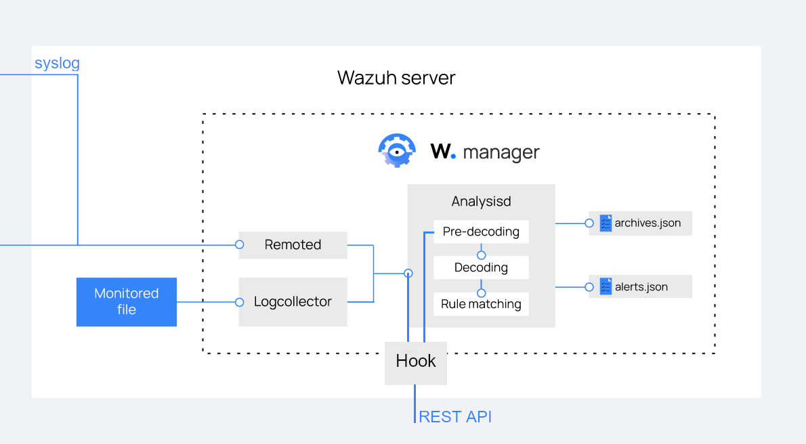

# Wazuh-Hook

Fork of [Wazuh](https://github.com/wazuh/wazuh/) with hook mechanism to intervene log analysis by accessing external REST API servers.

## Hook Architecture



## Changes

|New File|Path|
|---|---|
|hook.c|src/analysisd/output|
|hook.h|src/analysisd/output|
|pii.json|hook/|

|Modified File|Path|
|analysisd.c|src/analysisd|
|Makefile|src|

## Build

```
make -C src PII_ENABLED=1 TARGET=server 
```

Copy pii.json to ossec path:

```
cp src/pii.json /var/ossec/etc
```

